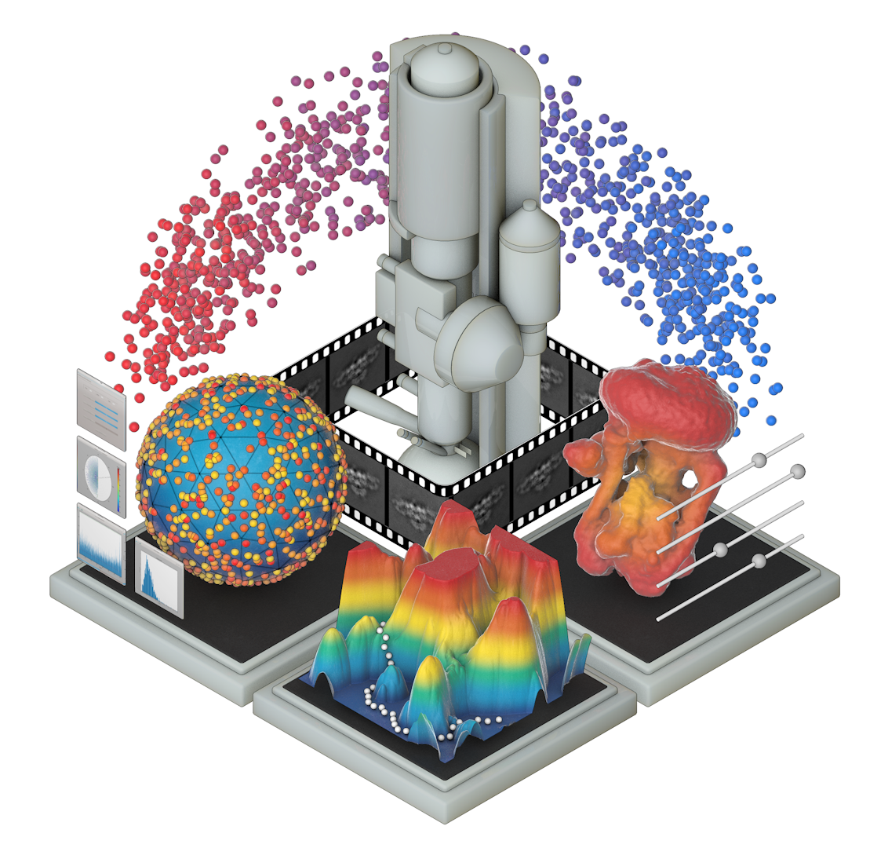
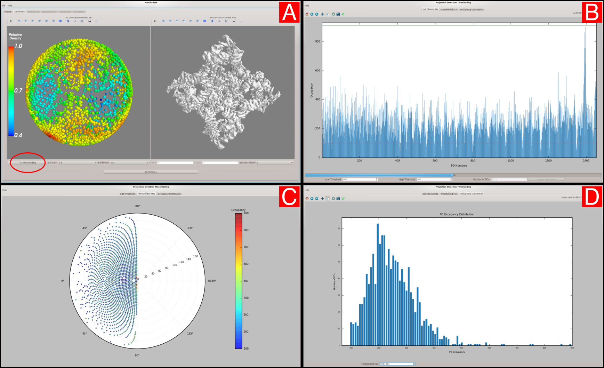
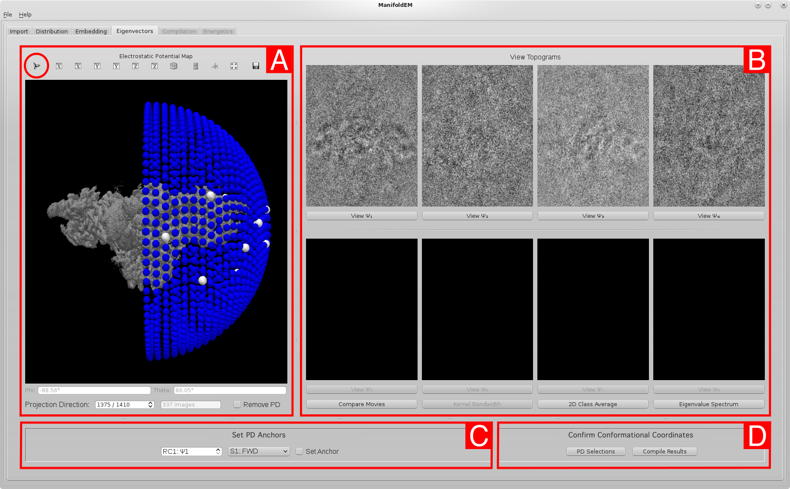
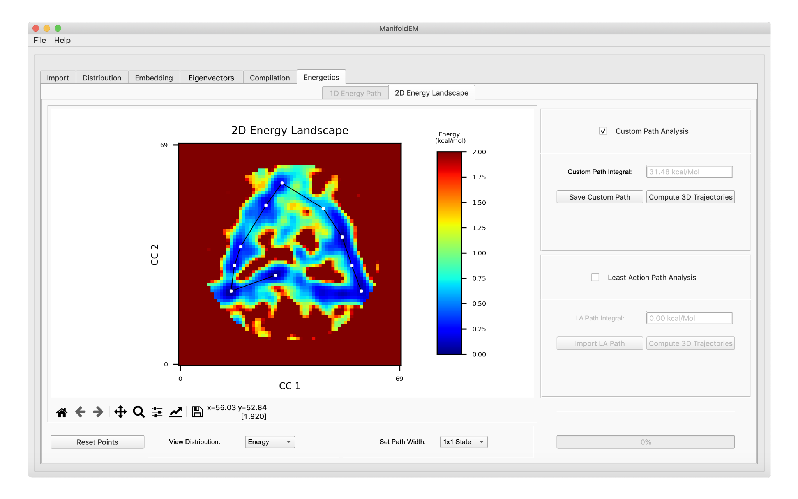

# NOTE:
This tutorial was pulled from a PDF file into markdown. Many things may display incorrectly or
be inaccurate. Please report any problems via the issues page or create a PR to address them.



# ManifoldEM User Manual
Evan Seitz, Robert Blackwell, Ghoncheh Mashayekhi, Hstau Liao, Suvrajit Maji,
Peter Schwander*, Abbas Ourmazd* and Joachim Frank*

Version 0.3.0

The dataset for this tutorial can be downloaded:
[RyR1GCs_demo.tar.gz](https://users.flatironinstitute.org/~rblackwell/manifold/RyR1GCs_demo.tar.gz)

# Introduction
This tutorial provides an overview of ManifoldEM (Beta version) in Python 3 for determination of
cryo-EM conformational continua, as was first introduced by Dashti et al. (2014). The tutorial
covers the entire manifold analysis workflow, from data preparation to construction of free-energy
landscape. Carefully going through this tutorial will prepare you for running ManifoldEM on your
own data. This tutorial uses a demo data set provided by Mashayekhi (2020), which is a small
subset of the experimental data provided by Amédée des Georges et al. (2016) used in the
functional pathway analysis of ryanodine receptor 1 (RyR1; Dashti et al., 2020). As such, this data
set should only be used for help in understanding the software and for training purposes. If you
have any questions about ManifoldEM after reading this entire document, carefully check the
ManifoldEM Python GitHub forum for similar inquiries or – if no similar posts exist – create a new
thread detailing your inquiry. As well, if you find any errors while reading this document, please let
us know.

## 1.1 ManifoldEM Motivation
Molecular machines are macromolecular assemblies – consisting of proteins or nucleoproteins –
that perform basic life functions and undergo numerous conformational changes in the course of
their work cycles. For some molecular machines, such as the ribosome, it has been possible to
develop in vitro systems with all components necessary to run productive work cycles delivering the
product, in this instance a protein. Even though the atomistic composition of molecules ultimately
defines a finite step size, the states form a virtual continuum due to the complexity of the structures
involved and the large number of steps in their interactions.
Through application of advanced imaging techniques, single-particle cryogenic electron microscopy
(cryo-EM; Frank 2006; 2016; 2017) allows these macromolecules to be individually visualized after
rapid freezing in vitreous ice at a rate that is assumed to be faster than the overall reconfiguration
time of the system (Whitford et al., 2011). As a result, the ensemble of molecules closely
approximates the thermal-equilibrium distribution of states immediately prior to being frozen.
Cryo-EM aims to capture the activity of the macromolecule in its complete form, encompassing its
continuum of accessible states.

The depth of information captured by cryo-EM has inspired numerous data-analytic approaches
that aim to systematically uncover these ensemble-characteristics. The algorithms underlying the
approach by Dashti et al. (2014) and later developments (Dashti et al., 2020 and Mashayekhi 2020),
summarily referred to as ManifoldEM, are one such approach. ManifoldEM uses geometric
machine-learning to identify the set of leading conformational motions best able to describe the
function of a molecular machine. It is based on the premise that, for a sufficiently large set of
snapshots obtained by single-particle cryo-EM, even energetically unfavored states of a molecule
are observed. As a consequence, the snapshots – by virtue of their similarity relationships – form a
quasi-continuum in high-dimensional space. Through manifold embedding, the data are
represented in a minimal low-dimensional space where coordinate axes express modes of the
conformational motions in a way that has to be discovered on a case-to-case basis. In the original
paper (Dashti et al., 2014), these modes were termed “reaction coordinates,” a term we wish to
avoid as it has different connotations in other fields. Instead, following the terminology of Dashti et
al. (2020), we will use “conformational coordinates” (CCs, for short) throughout this document.
Importantly, the number of sightings of a molecule in a particular state can be interpreted, via the
Boltzmann relationship, as a measure of free energy (Fischer et al., 2010). This transformation adds
probabilities to this space, giving the thermodynamic likelihood of a hop from any one state to any
of its immediate neighbors. The global geometry of the energy landscape characterizes the
molecular machine’s navigational probabilities, with deep wells representing distinct regions of
conformational states and mountainous regions constraining the transitions between them (Seitz
and Frank, 2020). Further, since specific sequences of conformations give rise to biomolecular
function, this descriptive mapping also identifies the molecular machine’s functional dynamics.
Through ManifoldEM, the potential now exists to create the conformational free-energy landscape
for any molecular machine capable of being visualized by cryo-EM. Results from previous
ManifoldEM studies on biological systems – including the ribosome (Dashti et al., 2014), ryanodine
receptor (Dashti et al., 2020) and SARS-CoV-2 spike protein (Sztain et al., 2021) – have proven its
viability and its potential to provide new information on the functional dynamics of biomolecules.

## 1.2 ManifoldEM Software Platforms
The original ManifoldEM methodology (Dashti et al., 2014) was implemented using Matlab code,
and has recently been made available for Matlab users (Mashayekhi, 2020). The ManifoldEM Python
Beta release mirrors an earlier (2019) 1D version of the Matlab code, except for a number of
additional enhancements to be elaborated on below. Importantly, in this Beta release, only the
generation of 1D energy paths have been made available. It is a work in progress to extend this
software package to incorporate 2D energy landscapes as done in the current Matlab package
(Mashayekhi, 2020). In addition, it is our plan for future ManifoldEM Python distributions to
incorporate an alternative method – ESPER: Embedded Subspace Partitioning and Eigenfunction
Realignment (Seitz et al., 2021) – able to combine with this current framework with potential to
enhance the quality of its final outputs. There are also several limitations to the current ManifoldEM
method that have been outlined by Mashayekhi (2020) and Seitz et al. (2021) – and detailed later in
Appendix E – which we believe ESPER is able to circumvent. As a final note, as the more recent
version of the Matlab code has now been published as a separate, actively-managed branch
(Mashayekhi, 2020), there is a future possibility of increasingly different, distinct features arising in
the Matlab and Python versions.

The Python code comprises two features not contained in the original Matlab code: (1) an
implementation of an automated angular propagation algorithm (Maji et al., 2020); and (2) an
advanced graphic user interface (GUI) that integrates all Python code, communicates with all
relevant files and facilitates the execution of essential operations, while providing informative
visualization of important intermediate and final outputs. A few words about the importance of the
GUI in steering and controlling the ManifoldEM analysis. Many advanced software systems now
employed in cryo-EM are of the “black box” type, allowing only the specification of a command
stream without feedback to the user, and without providing an intuition about the way parameter
choices affect the outcome (Maji and Frank, 2021). In this they sharply differ from interactive
modular software systems that popularized early research in single-particle cryo-EM (Frank et al.,
1996; van Heel et al., 1996) and offered instant feedback. The diversity in the nature of the input
data and in the kinds of questions asked in the ManifoldEM approach make the black box-type of
user control difficult to sustain even by experts, and virtually impossible in the hands of non-expert
users. The GUI presented here, by providing instant feedback on the impact of every parameter
choice, puts the user firmly in the driver’s seat, allowing them to steer the processing in the desired
direction.

## 1.3 ManifoldEM Alpha Release
Internal testing and debugging of code was conducted during the process of translating Matlab code
into Python and integration with GUI. More recently, a workflow for producing physically plausible
synthetic data was created (Seitz et al., 2019) and implemented for testing the fidelity of all modules
with heightened precision. By means of this flexible tool, the need for many of our
previously-mentioned innovations was first encountered and answered. In order to expand our
awareness of potential problems in software, performance and interface, we organized and
conducted an Alpha version release of the ManifoldEM Python suite, with scope limited to
acquisition of 1D energy landscape. All code was published on a private GitHub repository with
detailed documentation provided on installation, initiation and overall use of the ManifoldEM GUI.
The length of our alpha trial spanned approximately eight months, beginning in February and
ending by late August, 2019.

Our Alpha user group encompassed 10 individuals, comprising scientists and engineers from
various (cryo-EM related) fields. Extensive communications with these users were conducted by our
team via email or private GitHub forum to provide guidance on operations and errors encountered.
Alpha users were specifically instructed to test the software using their own or others’ published
online cryo-EM data sets. Both options were exercised, and as these users worked with a variety of
operating systems and hardware, we encountered a unique range of situations and unique sets of
problems to explore. This experience made us aware of shortcomings in documentation of
workflow, helped guide our team towards optimizing software performance and provided
opportunities to enhance useability through the user manual and tutorial now included in this
release. We hope this Beta release will likewise provide our team with useful feedback for
improvement, achievable now from a wider and more diverse audience.

## 2 Installation
We next detail the steps required to install the ManifoldEM Python 3 environment, which uses
packages required for visualization (frontend) and calculations (backend). The GUI is programmed
using PyQt5 and TraitsUI, with data visualizations achieved via Mayavi (3D) and Matplotlib (2D).
The majority of backend calculations are performed using NumPy. We also note that this Beta
release has only been thoroughly tested on Linux and MacOS operating systems.

## 2.1 Getting Started
We recommend using a unique directory for each cryo-EM data set you want to analyze (hereby
referred to as the project directory). The project directory can be downloaded from the GitHub
ManifoldEM_Python master branch via the clone or download button near the top of the main
page. Users can elect to either (1) download a .zip file and move it to their directory of choice –
unzipping the package therein – or (2) navigate to their directory of choice in the command line
interface (CLI) and perform the action: git clone <link>, where <link> is the GitHub-provided
URL link (sans brackets). In either case, the ManifoldEM project directory will be created at this
location and contain all the files needed to run the program.
Each ManifoldEM project directory should come equipped with: (1) a modules folder where all
backend algorithms are stored; (2) a GUI file for running the user interface; (3) an icons folder for
GUI graphics; (4) a copy of this manual; and (5) licensing information. You may find it convenient to
store your relevant cryo-EM input files within this newly created project directory. The root folder
name can be initially renamed to uniquely correspond to your project; however, it is imperative that
this name is not altered after a new project has been initiated, and that the core files within the
project directory are not edited or moved.

## 2.2 Installing the Environment
Before initializing the GUI, you need a python environment. Either install a version of conda or recent python3 distribution.

If using a python virtual environment:
```sh
python3 -m venv ~/envs/manifoldem
source ~/envs/manifoldem/bin/activate
pip install git+https://github.com/flatironinstitute/ManifoldEM
```

Or with conda:
```sh
conda create -n manifoldem
conda activate manifold em
pip install git+https://github.com/flatironinstitute/ManifoldEM
```

Note that when using conda, this bypasses conda's package management system and can lead to
problems if you later install packages into this environment with `conda install`. It's
recommended to keep an environment purely for `ManifoldEM`.

Now all you need to run this program, once your environment is activated, is to run
`manifold-gui`

# 3 Imports Tab
Upon opening the ManifoldEM Python GUI, you will be presented with the option to start a new
project or resume an existing one. If this wasn't your first time running the GUI, you could resume
progress at this point on a previous project by selecting that project's parameters .pkl file.
After selecting to start a new project, you will land on the first tab of the GUI (the Import tab), where
a number of fields are present requiring specific inputs. In order, these fields are: Average Volume;
Alignment File; Image Stack; Mask Volume; Project Name; Pixel Size; Resolution; Object Diameter and
Aperture Index. As well, two non-editable fields exist for Shannon Angle and Angle Width. We will
next go through each of these inputs in turn.

(As a note for those unfamiliar with cryo-EM terminology, the use of “volume” above is unique to the
cryo-EM community, and is shorthand for a “3D reconstruction” or, more technically, a “3D Coulomb
potential map”. Throughout this document, we will use “volume” to designate a 3D Coulomb
potential map resulting from 3D reconstruction in cryo-EM).

## 3.1 Average Volume
For this entry, browse for your molecule's Coulomb potential map (.mrc). For the RyR1 data set,
search for the file RyR1_AvgVol_Binned.mrc in the \demo directory of the ManifoldEM Python
repository. If you are running your own data set, this volume can be obtained by performing 3D
Auto-Refine on your alignment file in RELION. This average volume file will only be used to help you
navigate key aspects of your molecule throughout the ManifoldEM GUI. It has no other purpose in
the workflow.

## 3.2 Alignment File
For this entry, browse for your molecule's alignment file (.star), which links each of the 2D images
in the image stack to their corresponding orientational angles and related microscopy parameters.
This file is the product of orientational recovery via RELION as obtained either prior to 3D
classification or after combining a subset of classes from 3D classification. Please see the Resolution
section for guidelines on achieving optimal results. If running with the demo RyR1 data set, search
for the file RyR1GCs_clustRem.star. ManifoldEM requires (at minimum) the following parameters
within the alignment file: Image Name; Angle Rot; Angle Tilt; Angle Psi; Origin X; Origin Y; Defocus U;
Defocus V; Voltage and Spherical Aberration. To note, ManifoldEM is not currently set up to calculate
elliptical defocus; instead, it treats all cases of defocus as spherical. As well, although the software is
set up to handle image recentering, if your original micrographs are available, we recommend
recentering before ManifoldEM (and thus also setting Origin X and Origin Y values in the alignment
file to zero) as to avoid introduction of padding artifacts that could lower the fidelity of the distance
matrix.

We also note that ManifoldEM accepts both former and current (version-3.1) RELION formats. The
script read_alignfile.py automates this decision based on the presence of “data_optics” in the
header of the alignment file. Please consult the demo file RyR1GCs_clustRem.star as reference for
pre-3.1 formatting. If using an alternative package (e.g., cryoSPARC), alignment files will need to be
converted appropriately. For the example of using cryoSPARC, tools such as PyEM can be used to
convert to RELION.

## 3.3 Image Stack
For this entry, browse for your molecule's image stack (.mrcs), which is the set of all individual
molecular images obtained from particle picking. If running with the demo RyR1 data set, search for
the file RyR1GCs_clustRem.mrcs. We suggest that all images are unbinned and standardized (with
average density in the background approximately 0 and standard deviation in noise approximately
1). If you have multiple image stack files spread out across one or many folders, we also require they
first be joined into one singular stack for import into ManifoldEM. This can be done using the image
stacks' corresponding alignment file via the RELION command:
relion_preprocess --operate_on FOO.star --operate_out BAR
This operation will create a new (possibly smaller) alignment file and image stack containing only
those images referenced in the original alignment file.

## 3.4 Mask Volume
This entry is optional and should be included if you wish to mask out a specific region of your
molecule for processing in ManifoldEM. If running with the demo RyR1 data set, you can leave this
entry blank. Using this volumetric mask, all exterior voxels/pixels will be ignored during all future
computations (i.e., Distances and Optical Flow, which will be discussed later in this manual).
Volume Masks must be created external to ManifoldEM. While several methods exist, here we detail
one such workflow using Chimera and RELION. Assuming you have access to your macromolecule’s
structural information (in the form of 3D atomic coordinates from the PDB), Chimera’s molmap
command (along with a given input resolution; e.g., 20) can be used, followed by resampling of that
output volume (#1) onto the original coordinates. For example, this last step can be achieved by
importing your class average #0 into the scene and translating the new volume #1 to match its
position, then running vop resample #1 onGrid #0 to produce a resampled volume (#2). Next,
alter the isosurface level of the volume #2 in Chimera as needed and record the final number. After
saving this volume to file, relion_mask_create can be used (making sure to set the threshold
--ini_threshold in correspondence with your preferred isosurface level from Chimera) to create
an inclusion mask.

## 3.5 Project Name
This entry is optional and can be used for supplying names for different projects within the same
project directory. If no name is provided, the current date and time (taken when the project was
initialized) will be used. This project name will be used in the titles of both the outputs_<project
name> folder (containing all backend calculations) and params_<project name> file (containing all
user-defined parameters). If you choose a project name that is already being used within the same
project directory, you will be asked to either choose a different name or overwrite the previous
outputs folder and parameters file before proceeding to the next tab.

## 3.6 Pixel Size
This parameter defines the pixel size (Å/pixel) of the camera used to obtain your cryo-EM images.
This value can be found within your alignment file (rlnPixelSize), or if not present there
explicitly, can be obtained by dividing the value for rlnDetectorPixelSize by
rlnMagnification. For example, if your STAR alignment file shows a Detector Pixel Size of 5 𝜇m
and Magnification of 31000, your Pixel Size can be obtained via: 5e-6 / 31000 = 1.6129e-10.
If running with the demo RyR1 data set, set this value to 1.255 Å. As a note on RyR1, the published
Pixel Size actually deviates from the value obtained via the above calculation due to an additional
calibration technique. As a rule of thumb, if using a previously published data set, always make sure
to use the final value as listed in the publication itself.

## 3.7 Resolution
This parameter defines the resolvability in the Coulomb potential map of your molecule obtained
from Fourier Shell Correlation. If running with the sample RyR1 data set, set this value to 5 Å. If
using your own data set, the resolution can be obtained by running RELION 3D Auto-refine on your
alignment file. After doing so, navigate to the run.out file from the final iteration; near the bottom
of this file, you will find: Auto-refine: + Final resolution (without masking) is:
<float>. It is important to note that pursuing the highest resolution possible can actually be
counterproductive in determining the conformational continuum by ManifoldEM, as a tradeoff
exists between spatial resolution of a volume (representing an average of some limited number of
states) and differentiation of states (i.e., resolution in state space) in the molecule’s
quasi-continuum. Therefore, preprocessing techniques (such as data cleaning and removal of
low-occupancy class averages) should be as careful as possible to preserve the widest spectrum of
your molecule’s states. Please see Appendix C for more information on preprocessing.

## 3.8 Object Diameter
This parameter describes the maximum width of your protein structure; and should be taken to
approximate the maximum width of your molecule across all obtained projection directions and
conformations. If unknown, this distance can be approximated using Chimera. In Chimera, open the
3D Auto-refine MRC volume, navigate to the Tools > Volume Data > Volume Tracer window, and place
two data points on the most diametrically opposed voxels in your structure (with controls
determined via the Place Markers setting of that subwindow). Once these two markers are placed,
Ctrl-click the first marker, then Ctrl+Shift-doubleclick the second marker. Finally, choose the Show
Distance popup when it appears. If running with the sample RyR1 data set, you can set this value to
360 Å as recommended in Mashayekhi (2020).

## 3.9 Aperture Index
This parameter is an integer describing the aperture size in terms of the Shannon angle. If running
with the sample RyR1 data set, set the aperture index to 4. We recommend always starting with an
aperture index of 1. After all other inputs have been entered on the Import tab, the effects of this
value can be determined on the next tab (Distribution). We'll describe how to measure the goodness
of each aperture index in our discussion on Tessellation Thresholds in the next section. If you find
that an aperture index of 1 is unsuitable by the standards described there, you can return to the first
tab and increase its value to 2, repeating this process until an optimal value is obtained.
## 3.10 Shannon Angle
The Shannon angle is used to calculate the orientation bin size. This value will automatically
re-adjust as the other user inputs are altered. It is defined via:
Shannon angle = resolution / object diameter
## 3.11 Angular Aperture Width
This parameter represents the width of the aperture on S2
(in radians). Like the Shannon angle, this
value will automatically re-adjust as the other user inputs are altered. It is defined via:
angle width = aperture index ⨉ Shannon angle.
Once all inputs have been entered (sans optional entries: Mask Volume and Project Name), click the
View Orientation Distribution button at the bottom of the window to proceed to the Distribution tab.

## 4 Distribution Tab
The user alignment file contains information on the rotational orientations of each snapshot in the
ensemble. These images are naturally distributed across accessible orientations over an angular
space known as the two-sphere (S2
). ManifoldEM bins images within local clusters on S2
defined by
the boundaries of tessellated regions (a mosaic pattern of many virtually identical shapes fitted
together; Lovisolo et al., 2001). The size of the shapes used within this spherical tessellation is
determined by the Angle Width calculated on the first tab. Each tessellated region is given a unique
set of orientational angles defined by the average of the angular location of all images falling within
its boundaries.
The location of each of these centers on S2
are called Projection Directions (PDs), and represent an
average view of your molecule as seen from a collection of unique viewing angles. This allows the
group of images residing within the boundaries of each PD to be analyzed as sets independently
from all others. In this way, the inner conformational mechanics of the molecular machine are
isolated from the angles in which the molecular machine can be viewed in space. Naturally, as the
Angle Width increases, the total number of PDs will decrease while the number of images contained
in each of those PDs will increase.



Figure 1: Distributions for RyR1 (full −ligand data set) as visualized on the Distribution tab: [A] Distribution
tab; [B] Edit Thresholds; [C] Thresholded PDs; [D] Occupancy Distribution. To note, subwindows [B], [C] and [D]
are accessed via the encircled PD Thresholding button on the main Distribution tab. If you are using the demo
data set, the available PDs will form a great circle in angular space.

## 4.1 Orientation Navigation
Upon landing on the Distribution tab (Figure 1-A), you will see two figures that allow you to view
your molecule’s S2
Orientation Distribution (on the left) in tandem with its corresponding
Electrostatic Potential Map (on the right). Both figures are synced such that navigating the Mayavi
camera within either figure will automatically update the view of the other. The S2
Orientation
Distribution figure plots the occupancy of the projections mapped across S2
, with corresponding
heatmap defining the relative spatial density of projections. You can change the density of points
shown via the S2
Density value (e.g., 5 means that only every other 5th
image will be plotted as a
point in these coordinates). Be careful not to select more points to plot than your computer can
handle; by default, ManifoldEM chooses a very conservative value based on the size of your image
stack. The Electrostatic Potential Map is a depiction of the volume file you imported on the previous
tab. You can cycle through its contour depth via the Isosurface Level control. In the event that these
two objects are initially plotted with disproportionate scales, you can also change the relative scale
of these two figures via the S2
Scale value. In addition, the Mayavi icon can be clicked above each
figure to open a dialog housing expansive visualization options. The most recent settings chosen for
S2
Scale and Isosurface Level will also be applied to the equivalent figure on the Eigenvectors tab.
As you move the camera in either scene, notice that the current phi and theta value is updated in the
entries below. These are taken as the combination of Euler coordinates from which you are viewing
your objects. A guide for understanding the camera controls can be found in Appendix B of this
manual. To fully understand how your data has been tessellated, we'll need to next explore the PD
Thresholding subwindow, accessed via the corresponding button in the lower left-hand corner of
the Distribution tab.

## 4.2 Tessellation Thresholds
There are three tabs within the Projection Direction Thresholding subwindow: Edit Thresholds
(Figure 1-B), Thresholded PDs (Figure 1-C), and Occupancy Distribution (Figure 1-D).
On the Edit Thresholds tab, the bar chart shows the number of images captured within the
boundaries of each PD for the given Angle Width, with the PD Number plotted on the x-axis: labelling
each PD based on an arbitrary assignment of integers. This window also has two parameters: Low
Threshold and High Threshold. As these values are changed, the red and green horizontal lines in the
plot will shift their vertical position respectively. If a PD has fewer images than the number specified
by the Low Threshold parameter (red line), that PD will be ignored across all future computations.
The value shown in the Number of PDs display will also be updated to reflect this change. If a PD has
more images than the number (n) specified by the High Threshold parameter, only the first n images
under this threshold will be used for that PD. To finalize new Low and High Thresholds, make sure to
click the Update Thresholds button at the bottom of this tab before exiting the subwindow. If you’re
using the demo RyR1 data set, the default low and high thresholds can be used, resulting in 53 PDs.

The next tab over on the PD Thresholding subwindow (Thresholded PDs, Figure 1-C) shows the
number of remaining PDs after thresholding. These are plotted with polar coordinates, displaying
phi values on the perimeter-subdivisions and theta values on the radial-subdivisions. The
occupancy of each remaining PD can be seen via the colorbar on the right. The third tab (Occupancy
Distribution, Figure 1-D) displays a histogram showing the distribution of PD occupancies (the
number of images in each PD) across all PDs. The number of histogram bins can be altered via the
entry at the bottom to expand on this characterization. Using these three tools, you should be able
to make an assessment on the overall goodness of the Angle Width calculated on the Import tab (and
thus the variable Aperture Index you supplied). You want to find the optimal Aperture Index such
that the tessellation provides the most coverage across the S2
(as seen on the Thresholded PDs tab)
while also having a sufficient number of images in each PD (as seen on the Occupancy Distribution
tab).
As this is a very qualitative assessment, we note an additional option for those still unsure. It is
possible to first perform a test-run by increasing the low threshold value such that only a handful
(5-10) PDs are selected, and then decreasing the high threshold to the average value of images seen
across all PDs. Next, proceed through the Embedding tab (as described in the next section) with this
small sample and assess the quality of your conformational motions on the Eigenvectors tab. If the
motions present are too much obscured by noise or if too few motions are present per PD, you’ll
want to consider choosing a larger Aperture Index for your data set. In contrast, choosing an
Aperture Index that is too large may result in prominent CCs exhibiting rigid body rotations of your
macromolecule across the S2
. Once you have found the optimal Aperture Index for your needs, make
sure to create a fresh project where it is entered, while re-assessing your low and high thresholds to
instead calculate the full set of your best PDs.
If you try to move past tab 2, the GUI will provide you with a warning message. Upon choosing to
proceed, all of these previously established user-parameters will be locked in permanently for the
remainder of your project.

## 5 Embedding Tab
Within each isolated PD, embedding techniques are applied across the collection of corresponding
images to discover the latent conformational mechanics of the molecular machine (as seen from
that PD). These steps are performed in sequence on the Embedding tab, and are laid out into four
modules: Distance Calculation, Embedding, Spectral Analysis, and Compile 2D Movies.

## 5.1 Embedding Parameters
Before initiating the first module (via the Distance Calculation button), take note of the three entry
fields at the top of this tab: Processors, Eigenvectors, and Dimensions.

## 5.1.1 Processors
The Processors entry dictates the number of processors (corresponding to the number of PDs) your
computer will run in parallel during the proceeding steps. The maximum number is determined by
your workstation specs. This value should be set before pressing the Distance Calculation button
below, and cannot be changed again until all processes are complete (or if the project is quit, and
then resumed). As a note, if you ever need to debug an error that occurs, always re-run with
Processors set to 1, which will enter into single-processing mode. In this mode, command line error
messages are unobstructed from multiprocessing packages, providing the best diagnosis for your
problem. If you’re encountering performance problems (slowdowns or crashes), you may want to
consider running fewer processors.

## 5.1.2 Eigenvectors
The Eigenvectors entry is used to set the number of leading eigenvectors corresponding to the
diffusion maps embedding (discussed below), which are used in NLSA across all PDs. While a total
of 15 eigenvectors are used by default throughout all backend computations, the Eigenvectors entry
determines the number of leading eigenvectors from that set (up to a maximum of 8) for which a
NLSA will be performed. Importantly, only members from this set will be selectable as potential
conformational coordinates on the subsequent tabs, and once this decision is made, it cannot be
reversed. We recommend the maximum (8) if computational resources and time are plentiful. If
performing a test run on a subset of PDs, a much lower number (e.g., 1 to 3) is sufficient.

## 5.1.3 Dimensions
The Dimensions value defines the number of dimensions to be used in defining the conformational
coordinates (termed Conformational Coordinates or CCs) of the energy landscape. As an important
note, this value has been restricted to 1D for the Beta release.

With these three parameters filled, it’s time to start computing. The modules on this page can take
considerable time to compute (especially if a large number of Eigenvectors are chosen). If your
progress is interrupted at any time or if you need to exit the program, you can always resume from
where you last left off upon re-opening the GUI.

## 5.2 Distance Calculation
The first step in the manifold embedding pipeline is the construction of the distances graph
(initiated upon clicking the Distance Calculation button), in which the similarity of each image to the
other images in each PD is calculated.

## 5.3 Embedding
The next module (initiated via the Embedding button) uses the previous distance calculations to
create nonlinear conformational manifolds via the diffusion maps method (Coifman et al., 2006).
This embedding automatically yields orthogonal coordinates (eigenvectors) ranked according to
eigenvalue, with each coordinate assumed to describe a set of concerted changes.

## 5.4 Spectral Analysis
To reveal the nature of changes associated with each individual coordinate after the initial
embedding, Nonlinear Laplacian Spectral Analysis (NLSA; Giannakis, 2012) is used. During the
performance of NLSA, the original cryo-EM images are concatenated along one of the leading k
eigenvectors to produce a spatial series of so-called “supervectors” (Dashti et al., 2014). Nonlinear
SVD (via NLSA) is then used to extract characteristic NLSA images (topos) and their evolutions
(chronos) from these supervectors. Each topo/chrono pair constitutes an element of a biorthogonal
decomposition of the conformational changes along the given eigenvector. Noise-reduced snapshots
can be reconstructed from the topo/chrono pairs with significant (above-noise) singular values and
embedded to obtain the manifold characteristic of the conformational changes along the selected
line. This embedding results in a new set of eigenvectors in a different space, to high accuracy
forming a 1-dimensional manifold with known eigenfunctions {cos(kπτ) | k ∈ ℤ+
} parameterized by
a conformational parameter τ. This process enables the estimation of a density of points as a
function of τ together with an ordered sequence of 2D NLSA images. These 2D images are arranged
to form a 2D NLSA movie, designed to represent the conformational signal corresponding to the
eigenvector chosen from the initially-embedded manifold. In total, NLSA is performed for each of
the leading k eigenvectors independently, such that k 2D NLSA movies are constructed for each PD.
Supervised identification of “meaningful” conformational information (i.e., the CCs) among these k
2D NLSA movies is next required,with subsequent steps aimed at then connecting these CCs across
all PDs. Once the NLSA movies have been computed via the Compile 2D Movies module, you can
navigate to the Eigenvectors tab via the View Eigenvectors button at the bottom of the page. As an
important note, in the event that the Spectral Analysis module stalls (i.e., a relatively prolonged
period of time has elapsed since the previous file was written), counter-measures may need to be
explored. For more information, please see Appendix E for a description of bypassing stalled PDs.

## 6 Eigenvectors Tab
You will find that the Eigenvectors tab is segmented into 4 main parts (Figure 2), these are: (A) PD
Selection; (B) PD Eigenvectors; (C) Anchor Assignment; (D) Confirm Conformational Coordinates.


Figure 2: Outputs of the Embedding tab for RyR1 (full −ligand data set) as visualized on the Eigenvectors tab.
For changing all volume representation settings (including isosurface levels), click the encircled Mayavi icon.
The black boxes in subsection [B] are a result of choosing only four eigenvectors on the previous tab. Also take
note of the two subdividing lines separating these regions (first between [A, B] and second between [AB, CD]),
which can be dragged with the mouse to redistribute window spacing between Eigenvectors tab subsections
as needed.

## 6.1 PD Selection
In the figure window entitled Electrostatic Potential Map, you will find a series of colored nodes
encircling the input volume. Each node represents a unique PD from the set of all PDs obtained after
thresholding. By default, the page will open on the first PD, such that all of the initial information on
the Eigenvectors tab relates to this PD’s characteristics. The colors of these nodes signify groupings
of Connected Components: clusters of PDs that were deemed in close enough proximity to reliably
pass the information on conformational motion between them during Belief Propagation (discussed
in a later section). For example, if you have two clusters of PDs separated by a relatively large
distance in angular space (likely due to preferred orientations in experiment), two distinct colors
will be used for each cluster.

As you change the Mayavi camera angle in this subwindow (Figure 2-A), you can move from one PD
to the next. Releasing the mouse while hovering over a new location in the subwindow will
immediately snap the view to the PD closest to your current hover position, updating the entire
Eigenvectors tab in turn to correspond to this new PD’s characteristics. You can also elect to travel
directly to a specific PD via the Projection Direction entry (which reads as: PD Number / Total
Number of PDs seen at the bottom of Figure 2-A). To be specific, whenever a new PD is visited, you
will see the following entries update to correspond to this PD’s attributes: the phi and theta values
below the figure, the Projection Direction number, the number of images in the current PD, all
anchor information, 2D Class Average graph, Eigenvalue Spectrum graph, all images within the View
Topos subsection of the Eigenvectors tab, and all graphs accessed via buttons therein.

The figure itself will also update when either the Remove PD or Set Anchor checkboxes are selected,
turning the current node to either black or white, respectively. If the box for Remove PD is checked
for a given PD (to be done only if the information in that PD is deemed undesirable), ManifoldEM is
instructed to ignore it in all future computations. Anchor PDs play a much larger role, and will be
discussed in greater detail in the forthcoming sections.

## 6.2 PD Eigenvectors
When viewing a PD on the Eigenvectors tab, all of its conformational information from the previous
calculations is isolated for detailed analysis. The eight windows in Figure 2-B present the deviation
of the data from the mean (Topo) along the first i eigenvectors ( Ψ1, ... ,Ψi ); with i defined via the
Eigenvectors setting on the Embedding tab . The properties of each of the PD’s eigenvectors (Ψi) can
be explored under the View Topos heading by clicking the corresponding View Ψi button underneath
that specific window. Click the View Ψ1 button (seen in Figure 2-B) to open the analysis subwindow
for the current PD’s most prominent conformational motion. Inside of each View Ψi subwindow, you
will find a number of tabs: Movie Player; 2D Embedding; 3D Embedding; Chronos; Psi Analysis; Tau
Analysis.

## 6.2.1 Movie Player
The NLSA movie player displays the NLSA frames in sequential order from frame 1 to frame 50.
Each of these frames can be thought of as depicting an individual state, and the collection of frames
describes the conformational motion along a given eigenvector. Along with standard playback
controls, the movie can be scrubbed through via the slider at the bottom of the subwindow.

## 6.2.2 2D Embedding
The 2D Embedding tab projects the PD’s diffusion map embedding onto a two-dimensional plane.
The first dimension is set by the currently chosen eigenvector, while the second dimension is set by
the eigenvector having the next highest eigenvalue. By clicking anywhere on this plot, a red cross
will appear. Clicking again at a different location will spawn a second red cross which is immediately
connected to the first by a gray line. This tool can be used to draw shapes in the figure, such as to
enclose outlier clusters (with each point in the cluster representing an image). Once more than two
red crosses have been added, you can close your shape by pressing the Connect Path button at the
bottom of the page. Once the shape is closed, you can elect to view an average of all of the images
within that enclosed region via the View Cluster button, or to remove the cluster entirely via the
Remove Cluster button. At any time, you can also reset the shape by pressing the Reset Plot button.
Once a cluster has been removed, you must press the Update Manifold button for changes to take
place. This operation will tell the backend algorithms to recompute the manifold analysis steps
using only those images remaining after your removal. Upon completion of the cluster removal, the
subwindow will close, signifying that all eigenvector plots for the current PD have been updated. At
any time, you can navigate back to the 2D Embedding screen and revert your changes via the Revert
Manifold button.

## 6.2.3 3D Embedding
The 3D Embedding plot is a visualization tool for viewing the diffusion map embedding in
combinations of three coordinates. You can use the X-axis, Y-axis, and Z-axis entries at the bottom of
the screen to choose which combination of eigenvectors you’d like to use as coordinates. In addition,
you can rotate the plot in this selected 3D subspace to better understand the shape of your data.
This tool is especially useful for identifying candidate outlier clusters for removal.

## 6.2.4 Chronos
In this window, the chronos coming from Spectral Analysis are plotted. By default, only the first two
modes are retained to extract the NLSA images. In a later version of ManifoldEM, users will be given
the option to re-embed each manifold by selecting a new combination of these modes based on
qualitative assessment. For more information on chronos, see the supplementary material in Dashti
et al. (2014).

## 6.2.5 Psi Analysis
As mentioned in the Spectral Analysis section, after embedding the noise-reduced snapshots
(reconstructed images), the resulting 1-manifold should have a parabolic structure. If a 1-manifold
is not parabolic, the PD’s corresponding Diffusion Map may be inadequate either due to a lack of
snapshots from experiment, an unfavorable distribution of those snapshots within the
corresponding tessellated region of S2
, or because of the presence of outliers (appearing as separate
data clouds in the Diffusion Map). In the latter case, see the 2D Embedding section on how to
re-embed the Diffusion Map to possibly recover a parabolic 1-manifold via NLSA. However, if there
are no easily identifiable divergent clusters in the Diffusion Map to remove, you may want to
consider removing the PD completely (see the forthcoming Confirm Conformational Coordinates
section for more information on this process).

## 6.2.6 Tau Analysis
On the Tau Analysis tab, you’ll find two figures. In the left figure, every NLSA image index in the PD is
plotted in accordance with the NLSA state to which it has been assigned. The figure on the right
provides a histogram of this Tau Parameterization, showing the overall NLSA image occupancy for
each of the NLSA states. This information will eventually be propagated across all PDs for each
user-defined eigenvector.

## 6.2.7 Eigenvalue Spectrum
Along with the data pertaining to each individual eigenvector, distributions relating to the bulk
properties of all eigenvectors in each PD can also be viewed. Click the Eigenvalue Spectrum button to
view the relative strength of the PD’s eigenvectors (each representing an orthogonal conformational
motion captured within the DM embedding). In this figure, the blue bars signify those eigenvectors
that were calculated for detailed analysis (set via the Eigenvectors entry on the Embedding tab). All
other eigenvectors will be demarcated with gray, and have black images displayed for their
corresponding analysis in the View Topos GUI subsection on the main page (see Figure 2-B). The
larger the eigenvalue (y-axis) is for each eigenvector, the more prominent the conformational
motion along that eigenvector is relative to all others. Next, click the 2D Class Average button to view
an average of all images contained within the current PD.

## 6.2.8 Gaussian Kernel Bandwidth
Clicking the Kernel Bandwidth button will open a log-log plot of the sum of the elements of the
pairwise similarity matrix as a function of the Gaussian kernel bandwidth (ε). The linear region of
the hyperbolic tangent delineates the range of suitable epsilon values for the diffusion map
embedding. Twice the slope at the inflection point provides an estimate of the effective
dimensionality of the data (Ferguson et al., 2010). Visually, you should see a good fit to the
hyperbolic tangent, while quantitatively, this goodness-of-fit should manifest in a R2
value close to 1.
We note that while the Gaussian kernel bandwidth is well estimated, the value for the effective
dimensionality is unreliable. However, we include it here for completeness, and have provided more
information on this discrepancy in Appendix E.

## 6.3 Anchor Assignment
After viewing the eigenvector information (especially the 2D NLSA movies) for several different PDs
spread out across S2
, you should start to form a good idea of the types of conformational motions
present in your data. The next step is to decide which one of these motions you would like to
compile across all PDs to ultimately produce a corresponding 1D Energy Path for that motion, along
with a NLSA Image Stack and accompanying NLSA Alignment File for use in 3D reconstruction. This
motion should preferably be both biologically relevant and also easily observable within one of the
available eigenvectors across the majority of your PDs. Eigenvectors containing this motion may
also have a relatively high eigenvalue in each PD’s Eigenvalue Spectrum, but, due to the changes in
viewing directions, this is not always the case.

Once you have made your decision, go to the PD where this motion is the most easily identifiable. In
order to tell ManifoldEM your choice, you’ll need to use the tools within the Set PD Anchors section
at the bottom of the Eigenvectors tab (Figure 2-C). In the Conformational Coordinate 1 (CC1) entry
box, put in the number corresponding to your motion’s eigenvector within the current PD. In the
next entry (S1, for Sense 1), you have the option to choose either Forward (FWD) or Reverse (REV).
The Sense defines the directionality of your motion in each PD; you may have noticed that in some
PDs, your motion is playing in reverse with respect to movies of that same motion in other PDs. For
the first anchor, this choice is arbitrary and completely up to you. However, in each subsequent
anchor you may choose, the Sense of its 2D NLSA movie must be consistently defined relative to all
others. Once you have filled in these options for your first PD anchor, click the Set Anchor checkbox
(Figure 2-C). You’ll notice that the node representing your current PD in the figure above will update
its color to white to signify this change.

In theory, you can hand-select every PD in this way, being careful to choose the correct eigenvector
number and sense for your conformational motion in each PD until every node on your figure is
colored white. We’ve even included a feature for aiding in such a task (within the Compare Movies
subwindow) where you can directly compare any two NLSA movies side-by-side while altering
these parameters as you see fit. However, in practice, such a workflow requires painstaking
attention to detail and tremendous time, while also being significantly prone to human error
(especially when dealing with hundreds or thousands of PDs).
Instead, we’ve attempted to optimize this procedure through a combination of Optical Flow and
Belief Propagation (discussed in more detail within a later section) that approximately follow the
same human-performed algorithm proposed above (Maji et al., 2020). For this automation strategy
to work, only a handful of PDs are required in total. Importantly, we require a minimum of one
anchor per Connected Component, but the more that can be accurately defined, the better. To be
clear, you must make sure that the eigenvectors chosen as anchors are those of highest user
certainty, since placing an erroneous anchor into these algorithms will most likely produce chaotic
results.

If using the demo RyR1 dataset, however, it could be a helpful exercise to pick the 53 PDs present
therein by hand. Since there are only a few dozen PDs to consider, this exercise should take about 20
minutes, while also reinforcing an understanding of essential concepts for new users seeking
training. There are also a few PDs that should be removed. The following provides the decision
process needed to assign one such anchor when using the RyR1 data set:
“Starting at a highly informative PD for the first anchor (where all motions are present and easily
identifiable across all eigenvectors), which of its eigenvectors (1-8) represents the readily-identifiable
‘wing’ motion of RyR1; and is this motion playing (arbitrarily) FWD or REV within that eigenvector (as
seen in the 2D NLSA movie)? Next, is there another (preferably distant) PD where this same motion can
also be easily identified across its set of eigenvectors, and is its NLSA movie playing FWD or REV with
respect to the arbitrary Sense-assignment of the first anchor chosen?”

Our general workflow for assigning these anchors is to first check on the PDs with the highest
occupancy via the PD Occupancies button within the PD Selections subsection on the Eigenvectors
tab (Figure 2-D). For the RyR1 demo, search for the first PD in the ranked PD Occupancies list that
offers a good side view of RyR1, and determine if there is a 2D NLSA movie showing the wings
moving up/down with an accompanying “smooth” parabola in Psi Analysis. If there is more than one
option showing this motion, pick the leading eigenvector. Next, arbitrarily define the directionality
of motion (sense) as FWD; reserving REV for 2D NLSA movies playing in the opposite direction.
After setting this anchor information in the Set PD Anchors panel on the main Eigenvectors tab, it is
ideal to next increase S2
coverage by sporadically labelling a collection of spread out PDs with
anchor information. However, this should only be done for PDs where user confidence of
eigenvector/sense for the given CC is highest. If using the RyR1 demo data set with the suggested
parameters, you will see that the PD nodes are grouped into two clusters (Connected Components)
on S2
, with the nodes from each cluster visualized by red or blue coloring, respectively. When
numerous connected components exist, at least one PD anchor must be defined in each cluster so
that Belief Propagation can connect the conformational information across large empty regions on
S2
. For the demo data set, we recommend defining three spatially-separated PD anchors in each
connected component corresponding to the RyR1 wing-like motion. As a final note, during this
assessment, it is highly recommended that users remove PD nodes that provide no meaningful
conformational information. For the demo RyR1 data set, we identified and marked 7 PDs for
removal using the GUI interface.

## 6.4 Confirm Conformational Coordinates
Once a sufficient number of PD anchors have been chosen, a list of all user PD selections can be
accessed via the PD Selections button within the Confirm Conformational Coordinates subsection at
the bottom of the Eigenvector tab (Figure 2-D) . In this subwindow, there are two tabs: PD Editor and
PD Viewer.
The PD Editor tab allows you to view tables of all of your assignments for PD anchors and removals,
as well as reset your current selections of each class independently. Moreover, this tab provides a
way to save the currently selected PD Anchors and PD Removals as individual lists and load them
back in whenever needed. It is important to note that these selections are automatically saved upon
reaching the Compilation tab, but if you need to exit the program for any reason before all intended
anchors have been chosen (and thus before pressing Compile Results), it is essential that you save
your selections via these options. Finally, you can also view a sorted list of all PD occupancies as
well as a list of PDs which have undergone manifold re-embedding (as described in the 2D
Embedding section above).

## The PD Editor tab provides a polar-coordinate plot of all PDs according to their current user-defined
class. PD anchors are shown as gray diamonds and PD removals as black ⨉ marks. All other PDs that
are to-be-determined (TBD) by automation are displayed as colored dots corresponding to their
Connected Component grouping. Once you are satisfied with your choice of PD anchors, removals
and re-embeddings, click the Compile Results button at the bottom of the Eigenvectors tab to
proceed.

## 7 Compilation Tab
You’ll arrive next on the Compilation tab, where the conformational information from each
individual PD is stitched together into one global identity. Much like the Embedding tab, you’ll find a
row of user-defined parameters at the top of the window (Processors, Temperature and Export
Optical Flow) as well as a set of modules (Find Conformational Coordinates and Energy Landscape)
for initiating the corresponding backend algorithms and gauging their progress.

## 7.1 Compilation Parameters
## 7.1.1 Processors
The Processors entry dictates the number of processors your computer will run in parallel during
the proceeding steps. It will mirror the number set on the Embedding tab, but can be altered here as
needed before proceeding with the final outputs.

## 7.1.2 Temperature
The value set in the Temperature entry should correspond to the pre-quenching temperature of the
experiment immediately prior to rapid freezing. Specifically, it will be used in the Boltzmann
relationship to convert image occupancies into energies.

## 7.1.3 Export Optical Flow
This parameter is completely optional, and if turned on, will export additional images of optical flow
vectors to file during computation of the chosen conformational coordinate (Figure 3). As an
important note, turning this option on will significantly increase computation time, and should only
be used for investigating the underlying behavior of these outputs.


Figure 3: Example output file of flow vectors from a single PD when Export Optical Flow is enabled. Image
motion is expressed by the direction of the vectors, while the magnitude of the motions are expressed by the
relative color of each vector (with red denoting the maximum magnitude of motion in the NLSA movie). The
circular background region surrounding RyR1 was removed from computation via use of a spherical Mask
Volume.

## 7.2 Find Conformational Coordinates
Once you have filled in the appropriate values for the parameters at the top of the Compilation tab,
click the Find Conformational Coordinates button to initiate Optical Flow and Belief Propagation
across your entire data set. These two procedures aim to select the correct eigenvector/sense
combination for the user-defined conformational motion across all PDs. To achieve this, Optical
Flow is first used to define the most prominent visual motions in the 2D NLSA movies in terms of
feature vectors (based on a histogram of oriented gradients), which are calculated for every
eigenvector/sense combination across all PDs. Next, the set of all feature vectors in each PD is
compared to the set of all feature vectors in its immediate neighbors on the S2
.
Belief Propagation assesses the affinity between all pairwise-combinations of feature vectors
between all neighboring PDs, ultimately giving each comparison a likelihood score for how well it
conserves the intended conformational motion (defined by the PD anchors). These probabilities are
propagated across the network of PDs until uncertainty is minimized on the global scale. After this
process has been completed, you can check these eigenvector/sense assignments within the output
file located at: outputs_<project name>/CC/comp_psi_sense_nodes.txt, and compare the
fidelity of each PD’s assignment with the motions you see in the respective movie on the
Eigenvectors tab.

The ManifoldEM Python suite also includes a feature to automatically find erroneous PDs by
analysis of τ statistics. In certain situations, we have found that certain 2D NLSA outputs do not
converge depending on the images contained in a particular PD, and therefore generate 2D NLSA
movies that are “bad” (i.e., very noisy, jittery or almost completely static). This is also reflected as a
relatively discrete, narrow τ-value distribution for such movies. Our automation strategy uses the
interquartile range (IQR) to characterize the dispersion of the τ histograms for all movies across all
PDs. From the distribution of all IQR values, we automatically determine the cutoff IQR value which
separates relatively well spread-out histograms from the narrow ones. When all of the movies for a
given PD are below that IQR cutoff value, we automatically remove the PD from interfering with
belief propagation and obstructing final outputs.

## 7.3 Energy Landscape
Within the Energy Landscape module, for each PD’s chosen eigenvector, its corresponding τ
parameterization is subdivided into 50 uniformly spaced bins (each representing a unique NLSA
state), with the number of snapshots falling within each bin tallied towards its state’s occupancy (as
is visualized in the right-hand side figure under Tau Analysis).
In thermal equilibrium, we attribute differences in occupancy to differences in the molecules’ free
energy via the Boltzmann factor ΔG/kB T = -ln(ns /n0), where ns is the number of snapshots in the
current state and n0 is the occupancy of the maximum-occupancy state in the state space (Fischer et
al., 2010; Agirrezabala et al., 2012). The lowest observable occupancy in the ensemble represented
by the dataset, of one particle in a state, defines the highest measured free energy while the highest
observable occupancy defines the lowest measured free energy. The Boltzmann constant kB is a
physical constant that relates the average relative free energy of particles to their bulk temperature.
(Please see the Compilation Parameters section for information on the temperature, T). The free
energy of a state in this landscape is a thermodynamic quantity equivalent to the capacity of a
system to do work. Finally, this occupancy/energy information is integrated across the chosen
eigenvectors of all PDs, with the ordering of states within each defined via its Sense.
When only one degree of freedom is desired (or available), the NLSA occupancies and images
corresponding to the same CC content in different PD manifolds can be further compiled across S2
to
construct a 1D energy path and a set of corresponding reconstructed volumes. Although not
available in this Beta release, the NLSA procedure is more complicated when two degrees of
freedom are desired. For completeness, we note that after identification of two CCs, their respective
eigenvectors for the current PD manifold are used to isolate a 2D subspace therein. On this {CC1,
CC2} subspace, NLSA is performed independently along the directions of 180 uniformly-spaced
radial lines in the range θ ∈ [0, π]. This yields a collection of point densities (i.e., 1D occupancy
maps) n(τ,θ) for each θ. The collection of these 1D maps for all θ constitutes the 2D Radon transform
of a yet unknown 2D density map (i.e., the desired 2D occupancy map). An inverse Radon transform
is then applied to reconstruct the 2D density map. In addition, NLSA also retrieves the
noise-reduced images at each point in this map. As in the 1D case, this procedure must next be
performed for the eigenvector pairs corresponding to {CC1, CC2} in all other PD embeddings, from
which noise-reduced volumes can be reconstructed to form 3D movies of concerted conformational
motions.

## 7.4 Recompile Results
At any time after running Find Conformational Coordinates or Energy Landscape on the Compilation
tab, you are given the option to recompile this information. This can be done via the Recompile
Results button on the Eigenvectors tab (which was previously labelled Compile Results on the first
run). Subsequent results will only change if you wish to change your previously assigned PD
Anchors, PD Removals, Dimensions value (currently disabled in the Beta), or the Temperature value.

## 8 Energetics Tab
## 8.1 Energetics
The Energetics tab provides a visualization of the resulting energy landscape (i.e., 1D Energy Path,
for the Beta release) as integrated across all PDs, with the dimensionality d defined via the number
of chosen conformational coordinates (d=1 in this Beta release). Using the View Distribution button,
you can switch views between the 1D Occupancy Map and 1D Energy Path, showing the difference
between the initial occupancies across all PDs and the resulting transformation via the Boltzmann
factor.

In the 1D Energy Path representation, energetic wells represent the most energetically favorable
conformations along your chosen conformational coordinate. Likewise, energetic peaks represent
thermodynamically improbable states which constrain transitions between neighboring wells.
Given this context, if your energetics look biologically unnatural (completely flat as one example),
you may want to recheck your anchor assignments on the Eigenvectors tab, with the possibility of
redoing these calculations via the previously discussed Recompile Results button.
Before computing your 3D trajectory files along this conformational coordinate, you can change
how the states will be combined along the given trajectory via the Path Width option. The default
value (1) will result in 50 output image stacks, where each stack combines information only from
projections belonging to the state it corresponds to (one stack per state). As this value is increased,
a sliding window is introduced along the trajectory such that additional information from
neighboring states is included when building each of the 50 image stacks. For example, choosing 3
for the Path Width will tell each image stack {1, … , 50} to include its own images along with those
from its immediate neighbors; i.e., three microstates in total for each macrostate.

While not available in the Beta release, we provide here a glimpse of the 2D functionality of the
Python ManifoldEM GUI, which is a work in progress. As is planned, depending on the previous
choice of dimensionality, plots on the Energetics tab will be either 1D or 2D. In the case of 2D, the
user will be presented with a subsequent choice to define a path through the 2D energy landscape
(Figure 4). Using this interface, points can be added onto this 2D plot to form a custom path, with
corresponding integrated energy recorded. Alternatively, the user can elect to export this energy
landscape for analysis with external pathfinding programs – such as POLARIS (Seitz and Frank,
2020) – to potentially define a minimum-energy path of presumed biological significance. These
trajectories can then be imported into the ManifoldEM GUI for use in its final computations. After a
suitable path has been defined (if applicable), ManifoldEM will combine the NLSA movies from all
states and PDs along that path into corresponding image stacks and alignment files. Post-processing
modules, which are located external to the GUI in the ManifoldEM main folder hierarchy, can then be
run to use the projections in these image stacks to reconstruct NLSA volumes. The final result of this
framework is a sequence of successive 3D reconstructions along the chosen path, forming a 3D
movie. In the case of the 1D Energy Path, this sequence demonstrates the conformational changes
along a single CC.


Figure 4: 2D Energy Landscape tab showing outputs from the Ribosomal data set (Dashti et al., 2014), as
viewed in Mac OS. A set of user-defined coordinates have been handpicked to form a path through the
low-energy valley. This path can be used to generate the set of assets required to produce a final sequence of
NLSA volumes. Alternatively, the path of least action can be imported (as generated via external programs;
e.g., POLARIS) and similarly used.

## 8.2 3D Trajectories
Once you have selected a suitable path width, press the Compute 3D Trajectories button. During this
process, the images from all states across all PDs are combined into 50 image stacks and alignment
files, such that there is one image stack and corresponding alignment file for each state along your
trajectory. Each image stack {1, … , 50} contains all of the particles across S2
that fall within its
corresponding bin (state), with the angular information and microscopy parameters of each image
written into that stack’s alignment file.

## 9 Post-processing
After viewing the energy landscape (or energy path, for 1D) and computing 3D trajectories, a
collection of image stacks (.mrcs) and corresponding alignment files (.star) will be exported into
your outputs_<project_name>/bin directory. Each pairing in this collection coincides with one of
the 50 conformational states for your chosen motion, with each state containing information from
every PD across S2.

## 9.1 Volume Reconstruction
With these files generated, an external algorithm (RELION) can next be used to reconstruct 50
volumes from this collection, representing a 3D movie displaying the chosen conformational
motion. First, if you haven’t yet installed RELION, do so now via the instructions in Appendix A.
Once installed, navigate to the outputs_<project_name>/post/1_vol directory in the CLI, and
run the batch-reconstruction script there via: sh mrcs2mrc.sh.

## 9.2 Noise Reduction
After your 50 volume files have been produced via RELION’s reconstruction algorithm (as described
in the previous section), you can elect to clean them via our external (to the GUI) post-processing
scripts.

The first choice is via Singular Value Decomposition (SVD). The corresponding scripts are designed
to decompose your volume sequence into a series of modes, and eliminate noise by removing modes
below a singular value threshold. These two SVD scripts can be found in the
outputs_<project_name>/post/2_svd directory and include mrc2svd.sh and mrc2svd.py. You
can run both scripts at once by navigating to the above folder in the CLI (making sure the
ManifoldEM Anaconda environment is also activated) and inputting the command: sh mrc2svd.sh.
(To note, for volume files with large box sizes, these computations may take considerable time; e.g.,
hours). By default, the first and second eigenvector will be chosen as significant, and retained.
During this initial run, a figure entitled mrc2svd.png will be saved, showing the eigenvalue
spectrum for your data. After examining this plot, you can choose to rerun this procedure while
retaining a different set of user-defined eigenvectors by first changing the Topo_list variable
located at the top of mrc2svd.py, followed by again inputting the command sh mrc2svd.sh.
The second choice for noise reduction is via the mrc2denoise.py script, where either a Gaussian or
median filter can be applied to each volume. As well, the window size of the filter and range of states
on which the filter is applied can also be altered using the overhead parameters.

## 10 Citing Us and Asking Questions
If ManifoldEM is useful in your work, please cite Dashti et al. (2014) and this ManifoldEM Python
repository. If you have any questions about ManifoldEM after reading this entire document, carefully check the
ManifoldEM GitHub forum for similar inquiries or, if no similar posts exist, create a new thread
detailing your inquiry. As well, if you find any errors while reading this document, please let us
know.
