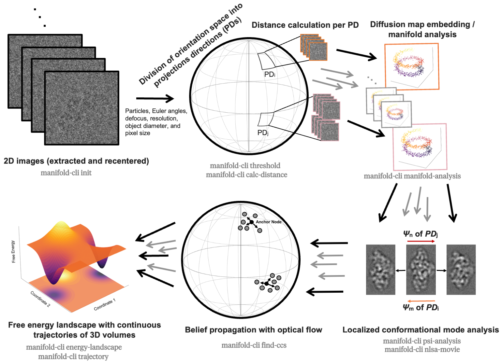
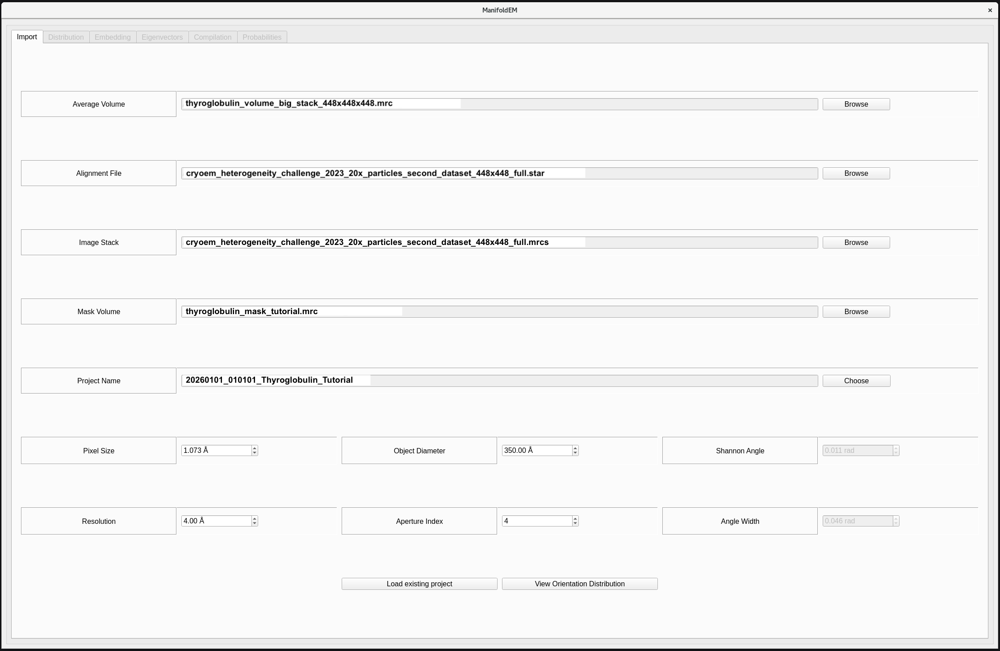
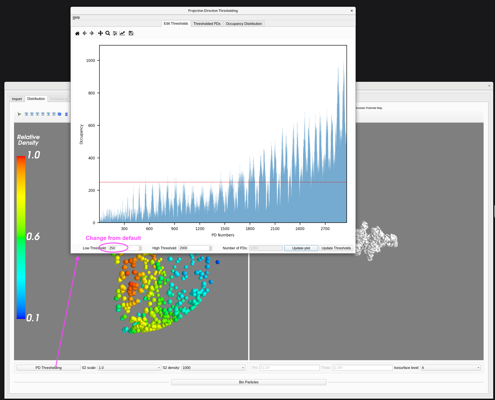
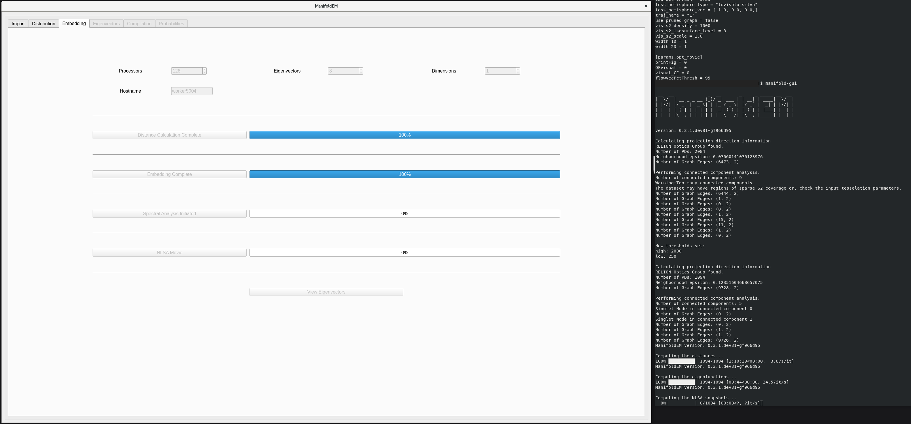
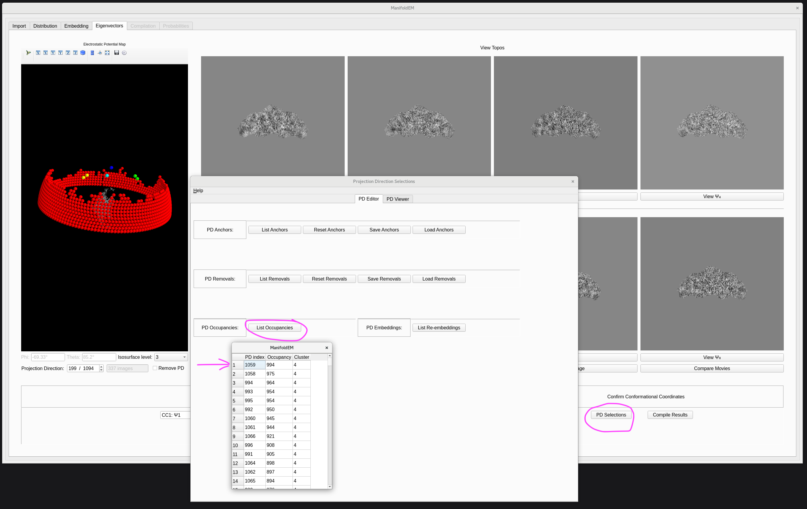
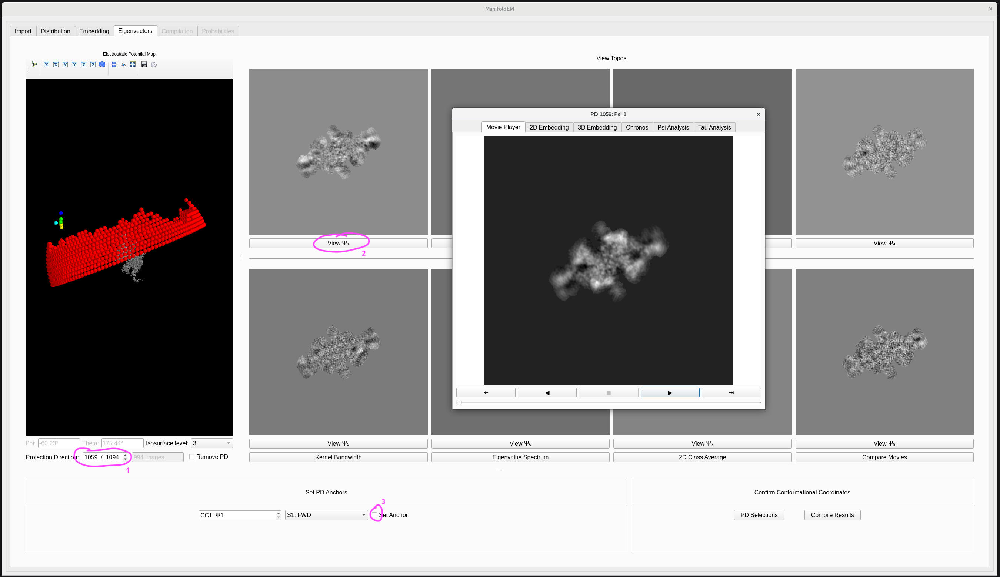
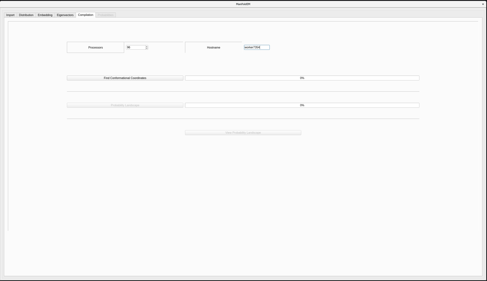
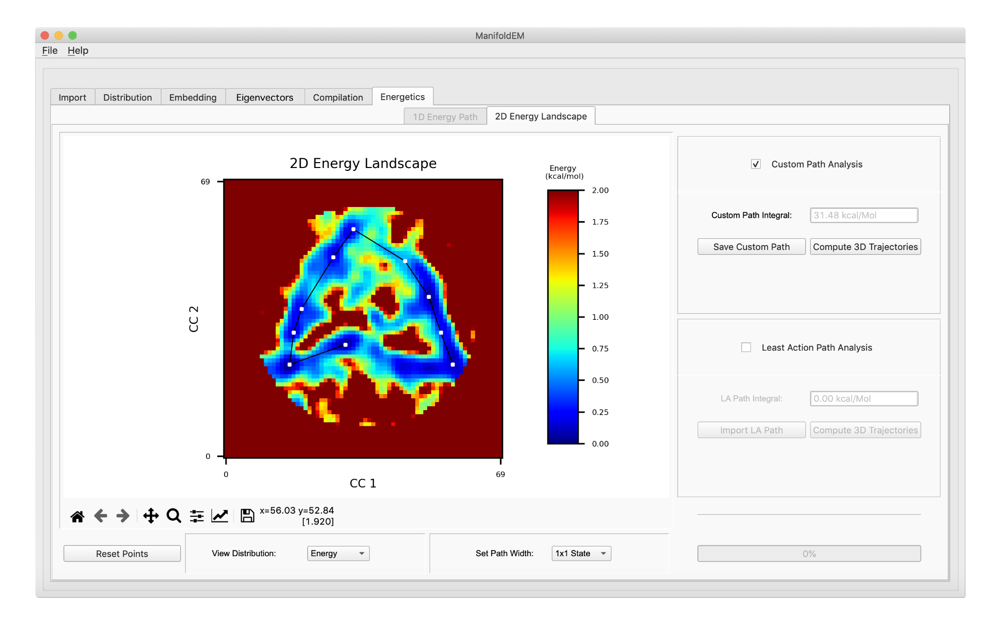

# FI-ManifoldEM Quick Start Tutorial


## Introduction

This tutorial walks through the analysis of two datasets. First a quick CLI-only tutorial of a great circle Ryanodine Receptor (RyR) dataset. Then a more in depth walk through of the GUI with a synthetic thyroglobulin dataset generated for the [Flatiron Institute Cryo-EM Heterogeniety Challenge](https://www.simonsfoundation.org/flatiron/center-for-computational-biology/structural-and-molecular-biophysics-collaboration/heterogeneity-in-cryo-electron-microscopy/). Both of these analyses using FI-ManifoldEM are also presented in [Ojha et al *Acta Cryst D*. 2025](https://doi.org/10.1107/S2059798325001469). Note that the CLI is more fully-described in [the main README.md](https://github.com/flatironinstitute/ManifoldEM/tree/main?tab=readme-ov-file#basic-command-line-interface), but the relevant commands are presented here alongside the GUI pipeline for clarity. If you have any issues with or find any errors in this tutorial, please let us know by [opening a new issue](https://github.com/flatironinstitute/ManifoldEM/issues).


### A brief history of ManifoldEM
The motiviation behind developing the Manifold Embedding method for cryo-electron microscopy (cryo-EM) (ManifoldEM for short) is that particle stacks in cryo-EM give access to the conformational landscape of the biomolecule that has been imaged. Rather than high resolution discrete states, which are given by more standard analysis pipelines, ManifoldEM provides access to the continuous trajectories along this conformational landscape. The method was first introduced by [Dashti et al. *PNAS* 2014](https://doi.org/10.1073/pnas.1419276111) in an analysis of an apo ribosome dataset, and was subsequently used in the functional pathway analysis of ryanodine receptor 1 (RyR1) in [Dashti et al., *Nature Comms* 2020](https://doi.org/10.1038/s41467-020-18403-x). These analyses were performed with [MATLAB code](https://github.com/GMashayekhi/ManifoldEM_Matlab). This particular version of ManifoldEM is a descendant of that MATLAB code, but more directly is a fork of [the ManifoldEM_Python repository](https://github.com/evanseitz/ManifoldEM_Python).

## Installation
To install FI-ManifoldEM we recommend following the steps on [the main README.md](https://github.com/flatironinstitute/ManifoldEM?tab=readme-ov-file#installation), which are also detailed below.
The main hurdle for installation are the packages required for the GUI, which
uses PyQt5 and TraitsUI, with data visualizations achieved via Mayavi (3D) and Matplotlib (2D).
The majority of backend calculations are performed using NumPy, which has fewer installation hiccups, thus we
recommend the CLI for those with trouble installing the GUI-dependencies.

Installation should work with in any modern Python/conda environment (Python 3.9+, though `mayavi` and
`pyqt` packages don't always immediately work with the most recent version of Python). If you don't
need the GUI, feel free to omit the "[gui]" part of the install command!

Python:
```bash
# create virtual environment. feel free to change the path!
python3 -m venv ~/envs/manifoldem
source ~/envs/manifoldem/bin/activate

pip install --upgrade pip
pip install "manifoldem[gui] @ git+https://github.com/flatironinstitute/ManifoldEM"

manifold-gui
```

conda:
```bash
conda create -n manifoldem python=3.10 -y
conda activate manifoldem

pip install "manifoldem[gui] @ git+https://github.com/flatironinstitute/ManifoldEM"

manifold-gui
```

Note that when using conda, this bypasses conda's package management system and can lead to
problems if you later install packages into this environment with `conda install`. It's
recommended to keep an environment purely for `ManifoldEM`.

# Preprocessing your cryo-EM data

  Before running FI-ManifoldEM, you will need to have run 3D refinement on your dataset using your cryo-EM analysis software of choice.
  ManifoldEM requires (at minimum) the following parameters within the alignment `.star` file: Image Name; Angle Rot; Angle Tilt; Angle Psi; Origin X; Origin Y; Defocus U; Defocus V; Voltage and Spherical Aberration. To note, ManifoldEM is not currently set up to calculate elliptical defocus; instead, it treats all cases of defocus as spherical. As well, although the software is set up to handle image recentering, if your original micrographs are available, we recommend recentering before ManifoldEM (and thus also setting Origin X and Origin Y values in the alignment file to zero) as to avoid introduction of padding artifacts that could lower the fidelity of the distance matrix. Additionally, the `.mrcs` image stack, will need to be a single file. If you have multiple image stacks, we recommend combining them into a single stack with e.g. `relion_stack_create`. Notably, the average volume file will only be used to help navigate through projection directions (PDs) in the GUI, and is not actually used within the algorithm.
  
### Important tips for choosing the Aperture Index
  
  Shannon Angle and Angle Width are calculated from your inputs, and will automatically re-adjust as the user inputs are altered. 
  
  The **Shannon Angle** is used to calculate the orientation bin size, and is defined as
  Shannon Angle = $\frac{\text{Resolution}}{\text{Object Diameter}}$.
  
  The **Angle Width** is the the width of the aperture on S2 (in radians), and is defined as
  Angle Width = Aperture Index $\times$ Shannon Angle.
  
  Thus, the combination of Resolution, Object Diameter, and Aperture Index all help define the width of the bins on the orientation sphere that will be used to define how many images are in a given PD. Getting this right can take some trial and error for each dataset -- usually by adjusting the Aperture Index between 1 and 4. 

# CLI-only RyR Tutorial

The dataset for this tutorial can be downloaded here:
[RyR1GCs_demo.tar.gz](https://users.flatironinstitute.org/~rblackwell/manifold/RyR1GCs_demo.tar.gz).


This is a pretty small dataset that you can run on a laptop or desktop, for which you can check how many processes to use with `nproc`. To initialize, the main inputs are `-p` project name, `-a` alignment file, `-i` image file, `-s` pixel size, `-d` object diameter, `-r` estimated resolution, and `-x` aperture index.

```
manifold-cli init -p 20260101_RyR_tutorial -a RyR1GCs_clustRem.star -i RyR1GCs_clustRem.mrcs -s 1.255 -d 360 -r 5.0 -x 4 
manifold-cli -n 16 calc-distance params_20260101_RyR_tutorial.toml
manifold-cli -n 16 manifold-analysis params_20260101_RyR_tutorial.toml
manifold-cli -n 16 psi-analysis params_20260101_RyR_tutorial.toml
manifold-cli -n 16 nlsa-movie params_20260101_RyR_tutorial.toml
```

To move forward through the pipeline, it is good to check at least the NLSA movie for your most populated projection direction:
```python
 from ManifoldEM.data_store import data_store
 from ManifoldEM.params import params
 params.load('params_20260101_RyR_tutorial.toml')
 prds = data_store.get_prds()
 top_PD = np.argmax(prds.occupancy)
 print(f"The PD with the most images is {top_PD} with {prds.occupancy[top_PD]} images.")
```

Which tells you "The PD with the most images is 52 with 565 images." Since Python is 0 index, we now migrate to `output/20260101_RyR_tutorial/topos` and open `PrD_53/psi_1.gif`.


In order to assign an anchor node to each cluster, we first need to figure out which PDs belong to which cluster. Using the same setup as above, continue on with:
```
> prds.cluster_ids 
array([0, 1, 1, 0, 0, 1, 1, 0, 0, 1, 1, 0, 1, 0, 1, 0, 1, 0, 1, 0, 0, 1,
       0, 1, 1, 0, 0, 1, 0, 1, 0, 1, 1, 0, 1, 0, 1, 0, 1, 0, 1, 0, 1, 0,
       1, 0, 1, 0, 1, 0, 1, 0, 1])

> cluster1 = np.where(prds.cluster_ids==0)[0]
> cluster1
array([ 0,  3,  4,  7,  8, 11, 13, 15, 17, 19, 20, 22, 25, 26, 28, 30, 33,
       35, 37, 39, 41, 43, 45, 47, 49, 51])

> cluster2 = np.where(prds.cluster_ids==1)[0]
> cluster2
array([ 1,  2,  5,  6,  9, 10, 12, 14, 16, 18, 21, 23, 24, 27, 29, 31, 32,
       34, 36, 38, 40, 42, 44, 46, 48, 50, 52])
```

Here we can see that our PDs are roughly equally distributed between two clusters, and we can see that PD 52 is in cluster2, so we can use that as an anchor node. Now let's pick an anchor node to use from cluster1.

Note that while there are many things to consider when picking anchor nodes besides the visual quality of the movies (the quality of the manifold, etc.), it is a good first approximation. Certainly, for the optical-flow based belief propagation, we need to look at the movies to decide if they are moving in the same sense or not, anyway.

```
> top_PD_cluster1 = np.argmax(prds.occupancy[cluster1])
> print(f"In cluster1, the PD with the most images is {cluster1[top_PD_cluster1]} with {prds.occupancy[cluster1[top_PD_cluster1]]} images.")
```

Which will give you "In cluster1, the PD with the most images is 45 with 450 images." - So now we can look at `PrD_46/psi_1.gif`. If you look at this gif you can see the 'arms' are moving down, while in the first movie they are moving up, so we will this define them as anchor nodes with opposite senses as follows:

```
from ManifoldEM.data_store import Anchor, Sense
prds.insert_anchor(52, Anchor(sense=Sense.FWD))
prds.insert_anchor(45, Anchor(sense=Sense.REV))
prds.save()
```

Once these anchor nodes are defined, you can move forward with the belief propagation step and building the probability landscape:
```
> manifold-cli -n 16 find-ccs params_20260101_RyR_tutorial.toml
> manifold-cli -n 16 probability-landscape params_20260101_RyR_tutorial.toml
> manifold-cli -n 16 trajectory params_20260101_RyR_tutorial.toml
```

Finally you can build volumes along this conformational coordinate. Note this requires `relion`, and we recommend the second denoising step:
```
> manifold-cli -n 16 utility mrcs2mrc params_20260101_RyR_tutorial.toml
> manifold-cli utility denoise params_20260101_RyR_tutorial.toml
```

# Thyroglobulin Tutorial

We will now walk through the analysis of a realistic-sized cryo-EM dataset (674,840 particles) with the FI-ManifoldEM pipeline. Note that though this is a synthetic dataset, the SNR has been decided to be similar to real data, and the pose distribution has been taken from a real dataset.

## Project Initialization

The input files (541 GB) for this are available from [this Globus link](https://app.globus.org/file-manager?origin_id=02d50b74-e14d-40b7-a555-8addf1ada896&origin_path=%2F). The mask is providedly separately for this tutorial. In short, the inputs required are:

  - Average Volume: `thyroglobulin_volume_big_stack_448x448x448.mrc`
  - Alignment File: `cryoem_heterogeneity_challenge_2023_20x_particles_second_dataset_448x448_full.star`
  - Image Stack:  `cryoem_heterogeneity_challenge_2023_20x_particles_second_dataset_448x448_full.mrcs`
  - Mask Volume: `thyroglobulin_mask_tutorial.mrc`
  - Pixel Size: 1.073 Angstrom
  - Resolution: 4.0 Angstrom
  - Object Diameter: 350 Angstrom
  - Aperture Index: 4
  
  Note that there is an option to 'Load an existing project' rather than start a new project using an existing `params_my_project.toml` file. The equivalent to this in the CLI is `manifold-cli -R params_my_project.toml`.
  
### GUI
To open the GUI make sure you have activated your environment and type:
```
manifold-gui
```

In the GUI the imports tab will look like this, though with your own full paths in the relevant places:

Click `View Orientation Distribution` to move onto the next step.

### CLI
To initialize this same project in the CLI:
```
manifold-cli init -p 20260101_thyroglobulin_tutorial -a cryoem_heterogeneity_challenge_2023_20x_particles_second_dataset_448x448_full.star -i cryoem_heterogeneity_challenge_2023_20x_particles_second_dataset_448x448_full.mrcs -s 1.073 -d 350 -r 4.0 -x 4 
```

## [Optional] Setting Thresholds

In the case of this thyroglobulin tutorial, we will need to adjust thresholds, however the default minimum number of images for a given PD is 100 and the default maximum number is 2000. If you find these thresholds acceptable, you can move onto the next step directly for your dataset.

### GUI
In the GUI to adjust the Thresholds by clicking the `PD Thresholding` button, adjusting the `Low Threshold` -- here adjust it to 250 for the tutorial, and cement this change by clicking `Update Thresholds`:

Click `Bin Particles` to move onto the next step.

### CLI
To set these same thresholds with the CLI:
```
manifold-cli threshold --prd_thres_low 250 params_20260101_thyroglobulin_tutorial.toml
```

## Running per-PD ManifoldEM

While this is the core of the method, it is actually the simplest part for the user to interact with. One aspect of these steps however, is that they are quite computational expensive, so we recommend running them on a cluster if possible for large datasets, such as the one we are using for this thyroglobulin tutorial. For the GUI, if your are using a Slurm for cluster management, for example you can allocate resources using `salloc` and the enter the approrpiate Hostname in the GUI with the appropriate number of processors for that node. For the CLI, you can run in an interactive job or by submitting directly to your cluster, however you prefer, and assign the correct number of processors using the `-n` flag. Note that FI-ManifoldEM is not currently GPU-compatible, so be sure to allocate only CPU nodes.

Broadly, the four steps here are:
- The **Distance Calculation** constructs the distances graph, in which the similarity of each image to the other images in each PD is calculated.
- The **Embedding** step uses the previous distance calculations to create nonlinear conformational manifolds via diffusion maps. This embedding automatically yields orthogonal coordinates (eigenvectors) ranked according to eigenvalue, with each coordinate assumed to describe a set of concerted changes.
- In **Spectral Analysis** the initial embeddings are mapped back into a more discernable coordinate space using Nonlinear Laplacian Spectral Analysis (NLSA). The characteristic NLSA images (topos) and their evolutions (chronos) from these supervectors are then extracted, and each topo/chrono pair constitutes an element of a biorthogonal decomposition of the conformational changes along the given eigenvector. Noise-reduced snapshots can be reconstructed from the topo/chrono pairs with significant (above-noise) singular values and
embedded to obtain the manifold characteristic of the conformational changes along the selected line. This embedding results in a new set of eigenvectors in a different space, to high accuracy forming a 1-dimensional manifold with known eigenfunctions {cos(kπτ) | k ∈ ℤ+
} parameterized by a conformational parameter τ.
- From this process 2D **NLSA Movies** can be generated, designed to represent the conformational signal corresponding to the eigenvector chosen from the initially-embedded manifold. In total, NLSA is performed for each of the leading k eigenvectors independently, such that k 2D NLSA movies are constructed for each PD.

### GUI

In the GUI, once the hostname and processors have been adjusted, you just click on all four buttons: 'Distance Calculation', 'Embedding', 'Spectral Analysis', and 'NLSA Movie'. These will run in sequence, you do not have to wait until one job is done before you start the next one. Note that the progress bar in the command line window may be a better guide of progress than the one in the GUI.

Once all jobs are complete, you can move on to `View Eigenvectors` where you can view the NLSA movies.

### CLI
```
manifold-cli -n 96 calc-distance params_20260101_thyroglobulin_tutorial.toml
manifold-cli -n 96 manifold-analysis params_20260101_thyroglobulin_tutorial.toml
manifold-cli -n 96 psi-analysis params_20260101_thyroglobulin_tutorial.toml
manifold-cli -n 96 nlsa-movie params_20260101_thyroglobulin_tutorial.toml
```

## Inspecting Eigenvectors and Aligning Conformational Coordinates
In this section you can inspect your NLSA movies and pick anchor nodes for belief propagation. 

### GUI
There are many things to explore here, but generally the best place to start is to first find your most populated PD by clicking on the 'PD Selections' button followed by the 'List Occupancies' button to see the PD with the highest occupancy. Here we see for this thyroglobulin dataset with these particular parameters the PD at index 1059 has the most particles with 994 particles.

Then you can close these windows and navigate to this PD by typing in its index in the 'Projection Direction' navigator. Then you can click on 'View Ψ1' to see the NLSA movie for the first psi of this PD and determine whether or not you think it is appropriate to assign as an anchor node.

Here we only need to pick a single anchor node, but in most real cases you will need to pick more than one, and you should ensure that the different anchor nodes move in the same direction, as an example: from open to closed, and not vice versa. If you need to change the direction of an anchor node, just change it from forward to backward in the 'Set PD Anchors' section. This directionality choice you make will then be propagated to all the PDs via the optical flow step that comes next. Also note that you can define any psi from a PD as the anchor node, not just the first one.

Once the anchor nodes have been selected you can move on by clicking 'Compile Results'.

### CLI
TBD

## Compile Results and Calculate Probability Distribution


## Volume Reconstruction

### CLI

 ** Below to still be shortened.

## 7.2 Find Conformational Coordinates
Once you have filled in the appropriate values for the parameters at the top of the Compilation tab,
click the Find Conformational Coordinates button to initiate Optical Flow and Belief Propagation
across your entire data set. These two procedures aim to select the correct eigenvector/sense
combination for the user-defined conformational motion across all PDs. To achieve this, Optical
Flow is first used to define the most prominent visual motions in the 2D NLSA movies in terms of
feature vectors (based on a histogram of oriented gradients), which are calculated for every
eigenvector/sense combination across all PDs. Next, the set of all feature vectors in each PD is
compared to the set of all feature vectors in its immediate neighbors on the S2
.
Belief Propagation assesses the affinity between all pairwise-combinations of feature vectors
between all neighboring PDs, ultimately giving each comparison a likelihood score for how well it
conserves the intended conformational motion (defined by the PD anchors). These probabilities are
propagated across the network of PDs until uncertainty is minimized on the global scale. After this
process has been completed, you can check these eigenvector/sense assignments within the output
file located at: outputs_<project name>/CC/comp_psi_sense_nodes.txt, and compare the
fidelity of each PD’s assignment with the motions you see in the respective movie on the
Eigenvectors tab.

The ManifoldEM Python suite also includes a feature to automatically find erroneous PDs by
analysis of τ statistics. In certain situations, we have found that certain 2D NLSA outputs do not
converge depending on the images contained in a particular PD, and therefore generate 2D NLSA
movies that are “bad” (i.e., very noisy, jittery or almost completely static). This is also reflected as a
relatively discrete, narrow τ-value distribution for such movies. Our automation strategy uses the
interquartile range (IQR) to characterize the dispersion of the τ histograms for all movies across all
PDs. From the distribution of all IQR values, we automatically determine the cutoff IQR value which
separates relatively well spread-out histograms from the narrow ones. When all of the movies for a
given PD are below that IQR cutoff value, we automatically remove the PD from interfering with
belief propagation and obstructing final outputs.

## 7.3 Energy Landscape
Within the Energy Landscape module, for each PD’s chosen eigenvector, its corresponding τ
parameterization is subdivided into 50 uniformly spaced bins (each representing a unique NLSA
state), with the number of snapshots falling within each bin tallied towards its state’s occupancy (as
is visualized in the right-hand side figure under Tau Analysis).
In thermal equilibrium, we attribute differences in occupancy to differences in the molecules’ free
energy via the Boltzmann factor ΔG/kB T = -ln(ns /n0), where ns is the number of snapshots in the
current state and n0 is the occupancy of the maximum-occupancy state in the state space (Fischer et
al., 2010; Agirrezabala et al., 2012). The lowest observable occupancy in the ensemble represented
by the dataset, of one particle in a state, defines the highest measured free energy while the highest
observable occupancy defines the lowest measured free energy. The Boltzmann constant kB is a
physical constant that relates the average relative free energy of particles to their bulk temperature.
(Please see the Compilation Parameters section for information on the temperature, T). The free
energy of a state in this landscape is a thermodynamic quantity equivalent to the capacity of a
system to do work. Finally, this occupancy/energy information is integrated across the chosen
eigenvectors of all PDs, with the ordering of states within each defined via its Sense.
When only one degree of freedom is desired (or available), the NLSA occupancies and images
corresponding to the same CC content in different PD manifolds can be further compiled across S2
to
construct a 1D energy path and a set of corresponding reconstructed volumes. Although not
available in this Beta release, the NLSA procedure is more complicated when two degrees of
freedom are desired. For completeness, we note that after identification of two CCs, their respective
eigenvectors for the current PD manifold are used to isolate a 2D subspace therein. On this {CC1,
CC2} subspace, NLSA is performed independently along the directions of 180 uniformly-spaced
radial lines in the range θ ∈ [0, π]. This yields a collection of point densities (i.e., 1D occupancy
maps) n(τ,θ) for each θ. The collection of these 1D maps for all θ constitutes the 2D Radon transform
of a yet unknown 2D density map (i.e., the desired 2D occupancy map). An inverse Radon transform
is then applied to reconstruct the 2D density map. In addition, NLSA also retrieves the
noise-reduced images at each point in this map. As in the 1D case, this procedure must next be
performed for the eigenvector pairs corresponding to {CC1, CC2} in all other PD embeddings, from
which noise-reduced volumes can be reconstructed to form 3D movies of concerted conformational
motions.

## 7.4 Recompile Results
At any time after running Find Conformational Coordinates or Energy Landscape on the Compilation
tab, you are given the option to recompile this information. This can be done via the Recompile
Results button on the Eigenvectors tab (which was previously labelled Compile Results on the first
run). Subsequent results will only change if you wish to change your previously assigned PD
Anchors, PD Removals, Dimensions value (currently disabled in the Beta), or the Temperature value.

## 8 Energetics Tab
## 8.1 Energetics
The Energetics tab provides a visualization of the resulting energy landscape (i.e., 1D Energy Path,
for the Beta release) as integrated across all PDs, with the dimensionality d defined via the number
of chosen conformational coordinates (d=1 in this Beta release). Using the View Distribution button,
you can switch views between the 1D Occupancy Map and 1D Energy Path, showing the difference
between the initial occupancies across all PDs and the resulting transformation via the Boltzmann
factor.

In the 1D Energy Path representation, energetic wells represent the most energetically favorable
conformations along your chosen conformational coordinate. Likewise, energetic peaks represent
thermodynamically improbable states which constrain transitions between neighboring wells.
Given this context, if your energetics look biologically unnatural (completely flat as one example),
you may want to recheck your anchor assignments on the Eigenvectors tab, with the possibility of
redoing these calculations via the previously discussed Recompile Results button.
Before computing your 3D trajectory files along this conformational coordinate, you can change
how the states will be combined along the given trajectory via the Path Width option. The default
value (1) will result in 50 output image stacks, where each stack combines information only from
projections belonging to the state it corresponds to (one stack per state). As this value is increased,
a sliding window is introduced along the trajectory such that additional information from
neighboring states is included when building each of the 50 image stacks. For example, choosing 3
for the Path Width will tell each image stack {1, … , 50} to include its own images along with those
from its immediate neighbors; i.e., three microstates in total for each macrostate.

While not available in the Beta release, we provide here a glimpse of the 2D functionality of the
Python ManifoldEM GUI, which is a work in progress. As is planned, depending on the previous
choice of dimensionality, plots on the Energetics tab will be either 1D or 2D. In the case of 2D, the
user will be presented with a subsequent choice to define a path through the 2D energy landscape
(Figure 4). Using this interface, points can be added onto this 2D plot to form a custom path, with
corresponding integrated energy recorded. Alternatively, the user can elect to export this energy
landscape for analysis with external pathfinding programs – such as POLARIS (Seitz and Frank,
2020) – to potentially define a minimum-energy path of presumed biological significance. These
trajectories can then be imported into the ManifoldEM GUI for use in its final computations. After a
suitable path has been defined (if applicable), ManifoldEM will combine the NLSA movies from all
states and PDs along that path into corresponding image stacks and alignment files. Post-processing
modules, which are located external to the GUI in the ManifoldEM main folder hierarchy, can then be
run to use the projections in these image stacks to reconstruct NLSA volumes. The final result of this
framework is a sequence of successive 3D reconstructions along the chosen path, forming a 3D
movie. In the case of the 1D Energy Path, this sequence demonstrates the conformational changes
along a single CC.


Figure 4: 2D Energy Landscape tab showing outputs from the Ribosomal data set (Dashti et al., 2014), as
viewed in Mac OS. A set of user-defined coordinates have been handpicked to form a path through the
low-energy valley. This path can be used to generate the set of assets required to produce a final sequence of
NLSA volumes. Alternatively, the path of least action can be imported (as generated via external programs;
e.g., POLARIS) and similarly used.

## 8.2 3D Trajectories
Once you have selected a suitable path width, press the Compute 3D Trajectories button. During this
process, the images from all states across all PDs are combined into 50 image stacks and alignment
files, such that there is one image stack and corresponding alignment file for each state along your
trajectory. Each image stack {1, … , 50} contains all of the particles across S2
that fall within its
corresponding bin (state), with the angular information and microscopy parameters of each image
written into that stack’s alignment file.

## 9 Post-processing
After viewing the energy landscape (or energy path, for 1D) and computing 3D trajectories, a
collection of image stacks (.mrcs) and corresponding alignment files (.star) will be exported into
your outputs_<project_name>/bin directory. Each pairing in this collection coincides with one of
the 50 conformational states for your chosen motion, with each state containing information from
every PD across S2.

## 9.1 Volume Reconstruction
With these files generated, an external algorithm (RELION) can next be used to reconstruct 50
volumes from this collection, representing a 3D movie displaying the chosen conformational
motion. First, if you haven’t yet installed RELION, do so now via the instructions in Appendix A.
Once installed, navigate to the outputs_<project_name>/post/1_vol directory in the CLI, and
run the batch-reconstruction script there via: sh mrcs2mrc.sh.

## 9.2 Noise Reduction
After your 50 volume files have been produced via RELION’s reconstruction algorithm (as described
in the previous section), you can elect to clean them via our external (to the GUI) post-processing
scripts.

The first choice is via Singular Value Decomposition (SVD). The corresponding scripts are designed
to decompose your volume sequence into a series of modes, and eliminate noise by removing modes
below a singular value threshold. These two SVD scripts can be found in the
outputs_<project_name>/post/2_svd directory and include mrc2svd.sh and mrc2svd.py. You
can run both scripts at once by navigating to the above folder in the CLI (making sure the
ManifoldEM Anaconda environment is also activated) and inputting the command: sh mrc2svd.sh.
(To note, for volume files with large box sizes, these computations may take considerable time; e.g.,
hours). By default, the first and second eigenvector will be chosen as significant, and retained.
During this initial run, a figure entitled mrc2svd.png will be saved, showing the eigenvalue
spectrum for your data. After examining this plot, you can choose to rerun this procedure while
retaining a different set of user-defined eigenvectors by first changing the Topo_list variable
located at the top of mrc2svd.py, followed by again inputting the command sh mrc2svd.sh.
The second choice for noise reduction is via the mrc2denoise.py script, where either a Gaussian or
median filter can be applied to each volume. As well, the window size of the filter and range of states
on which the filter is applied can also be altered using the overhead parameters.

## 10 Citing Us and Asking Questions
If ManifoldEM is useful in your work, please cite Dashti et al. (2014) and this ManifoldEM Python
repository. If you have any questions about ManifoldEM after reading this entire document, carefully check the
ManifoldEM GitHub forum for similar inquiries or, if no similar posts exist, create a new thread
detailing your inquiry. As well, if you find any errors while reading this document, please let us
know.
